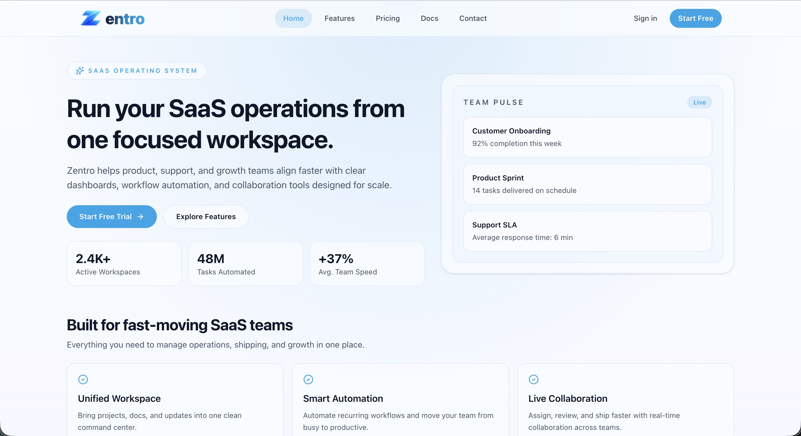
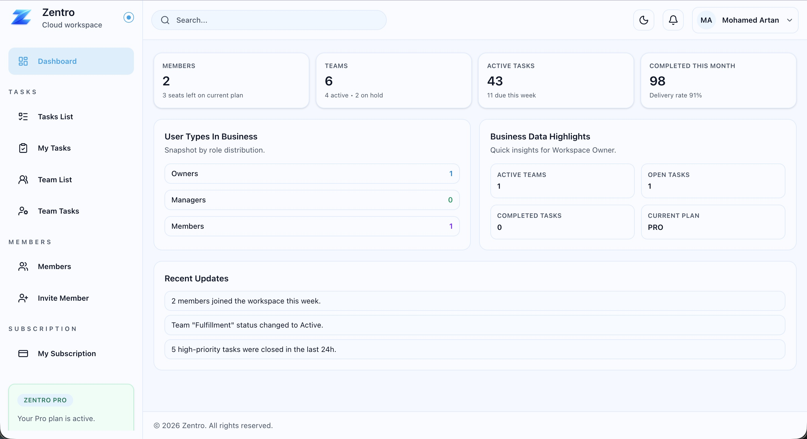
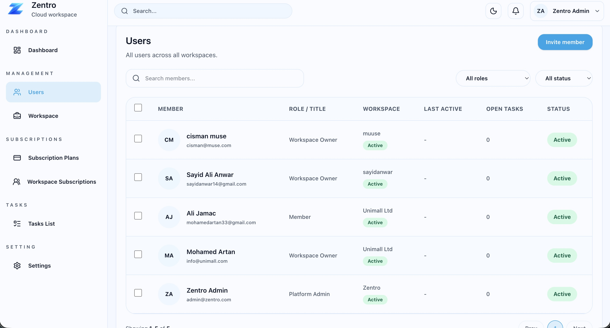
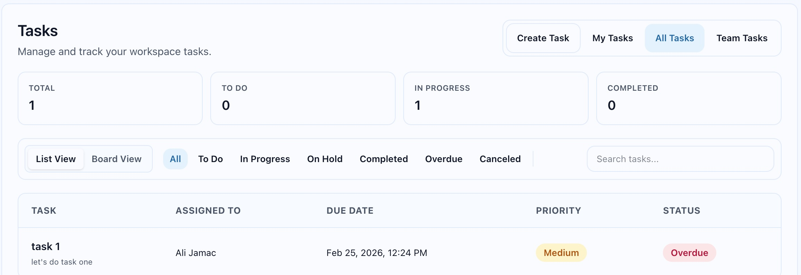
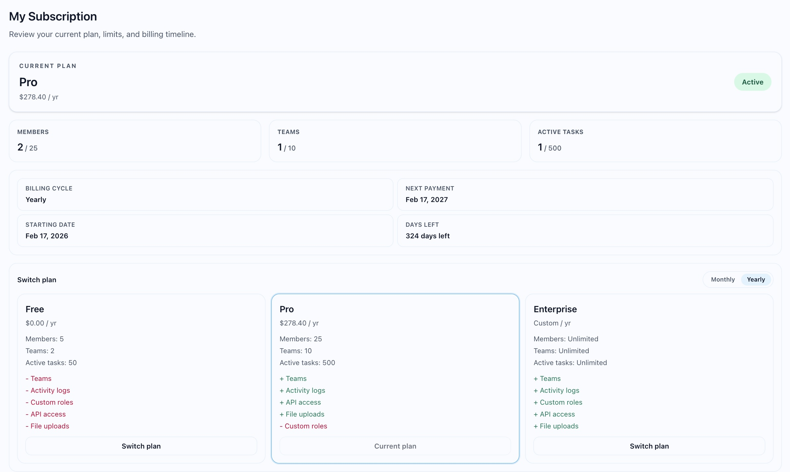
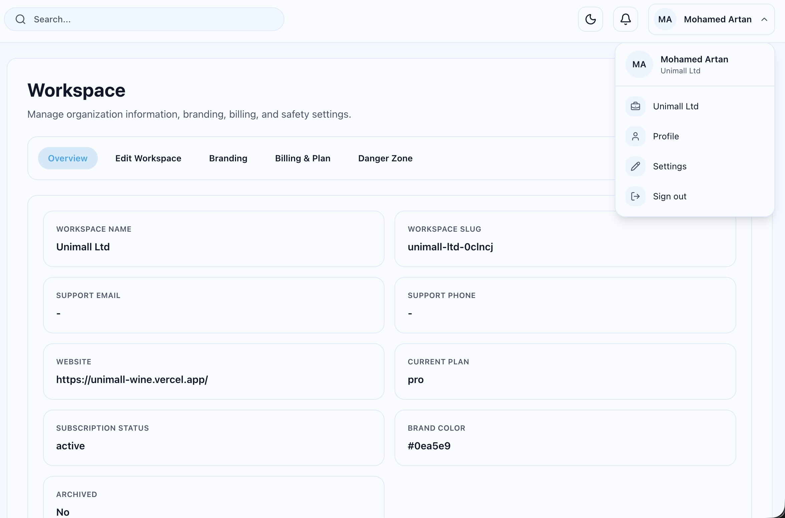
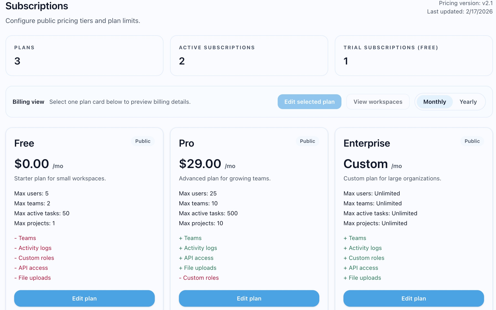
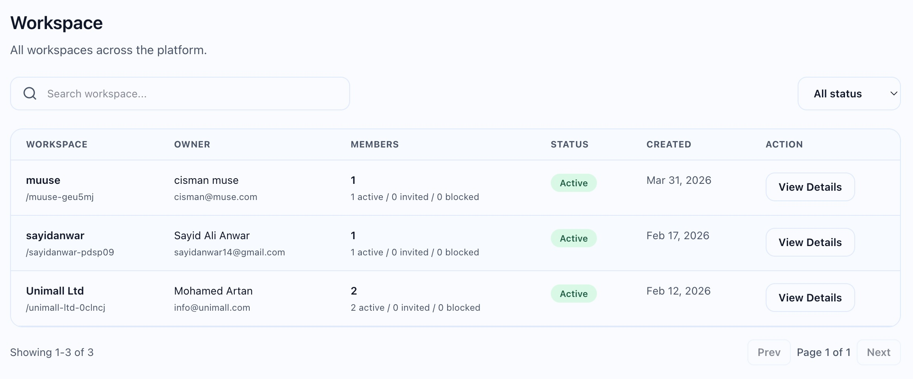

# Zentro – SaaS CRM Platform

Zentro is a full-stack SaaS CRM platform designed to help businesses manage teams, tasks, workspaces, and subscriptions in one centralized system.

It enables organizations to streamline workflows, manage users, and scale operations with role-based access and subscription-based features.

🔗 Live Demo: https://zentro-olive.vercel.app/

---

## 🚀 Features

- Multi-tenant workspace system
- Role-based access control (Admin, Owner, Member)
- Task management (list, status, priorities)
- Team collaboration and assignment
- Subscription plans (Free, Pro, Enterprise)
- Workspace and billing management
- Super Admin dashboard
- Cross-platform deployment (Vercel + Railway + Supabase)

---

## 🧱 Tech Stack

### Frontend

- React + TypeScript
- Tailwind CSS

### Backend

- Node.js + Express

### Database

- Supabase (PostgreSQL)

### Deployment

- Frontend: Vercel
- Backend: Railway

---

## 📸 Screenshots

### 🏠 Landing Page

### 📊 Dashboard

### 👥 Members Management

### ✅ Task Management

### 💳 Subscription (User)

### 🏢 Workspace Management

### 🛠️ Admin Panel – Workspaces

### 💼 Admin Panel – Subscription Plans

---

## 🧠 Key Learnings

During development, I handled real-world challenges including:

- Cross-origin authentication issues between frontend and backend
- Safari cookie restrictions and secure session handling
- SaaS architecture design (multi-tenant + subscriptions)
- Deployment across multiple platforms

---

## 📌 About the Project

Zentro is built as a scalable SaaS system following modern architecture practices.  
SaaS CRM platforms are cloud-based systems that help businesses manage customer data, workflows, and operations through a subscription model [oai_citation:0‡Creatio](https://www.creatio.com/glossary/saas-crm?utm_source=chatgpt.com).

This project demonstrates:

- real-world system design
- production deployment
- full-stack development skills

---

## 📬 Contact

Feel free to connect or reach out for collaboration.
